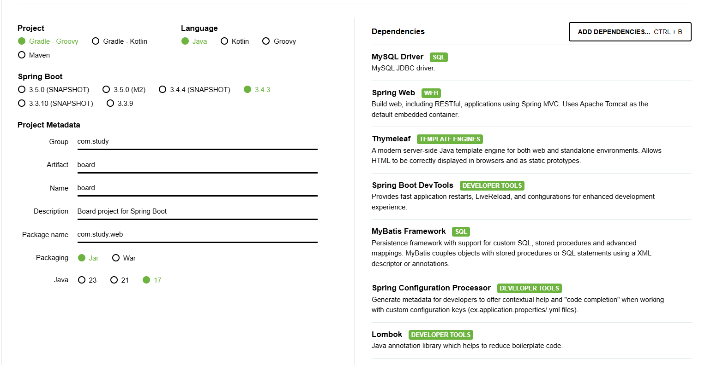
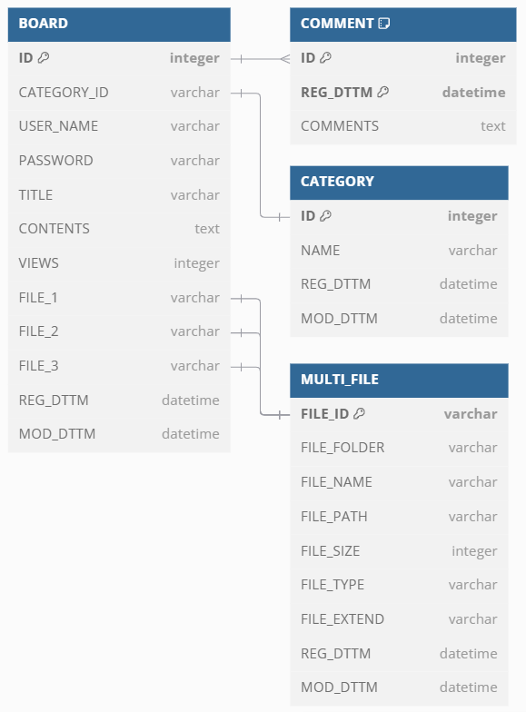

# 프로젝트 소개
- SpringBoot 게시판
- 게시판 목록 조회, 상세 조회, 등록, 수정, 삭제를 구현
- SpringBoot / thymeleaf / Mysql / mybatis / git

## 기간
2025.02.24(월) ~ 2025.02.28(금)

## 의존성 추가

## DB 구조

## 이슈
- 게시글 삭제 시 비밀번호 확인

## 후기
이번 주는 생각 없이 코드를 짠 것 같다. 
지적 받은 것도 많았고 집중도 잘 못한 주였다. 
지적 받은 것을 적용하여 다음 프로젝트는 더 질 좋은 코드를 만들어보겠다. 
다음 주 부터 이 프로젝트를 기반으로 SpringBoot API - React로 프로젝트를 수행한다. 
[SpringBoot를 SpringBoot API - React로... repository 가기 ><](https://github.com/sun-8/eb-study-springboot-react)